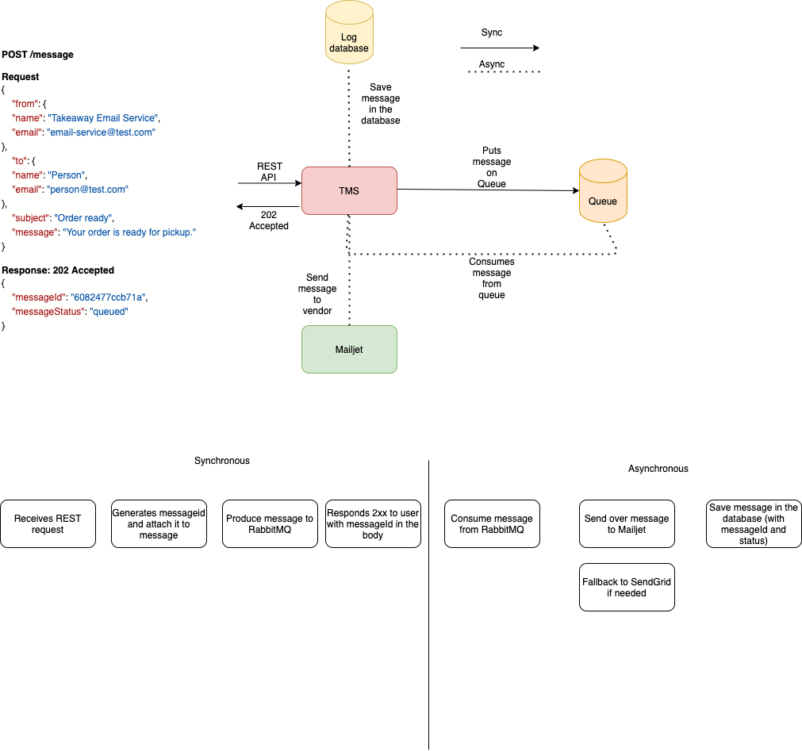

# Takeaway Email Service

This is an e-mail notification service.

This was built with:
* PHP 7.4
* Laravel 7
* Mysql
* RabbitMQ

### What do you need?
1. Docker and Docker compose
2. Make (optional)

## How to run the app
0. Setup your environment
```shell
$ cp .env.example .env
```
You will need these three env vars in order to send e-mails:
```shell
MAILJET_PUBLIC_KEY=
MAILJET_PRIVATE_KEY=
SENDGRID_API_KEY=
```
You can get them at Sendgrid and Mailjet, or you can ask me and I can
borrow you mine :)
Every other environment variable is set.

1. Run the app with docker compose
```shell
docker compose build app
docker compose up -d
```
2. Install migrations
```shell
docker compose exec php artisan migrate
```
3. Run the queue worker
```shell
docker compose exec php queue:work
```

Or if you have make installed you can run
```shell
$ make build
$ make start
$ make setup
```

## Other useful make commands
1. Execute shell into the application
```shell
$ make shell-app
```
2. Execute shell into the database
```shell
$ make shell-db
```
3. Stop docker compose
```shell
$ make stop
```
4. Install dependencies
```shell
$ make install
```
5. Retrieves all the messages that got sent
```shell
$ make get-messages
```

## API Endpoints
This API has 2 endpoints. One for sending a message and another one
for retrieving all messages. They are documented as below.

```http
$ POST /messages
202 ACCEPTED
```
### Request
```json
{
    "from": {
        "name": "Lucas",
        "email": "lucasmatzenbacher@gmail.com"
    },
    "to": {
        "name": "Lucas",
        "email": "lucasmatzenbacher@gmail.com"
    },
    "subject": "it worked",
    "message": "test"
}
```
### Response
```json
{
    "messageId": "607fbe5196aba",
    "messageStatus": "Queued"
}
```
* IMPORTANT: Check spam folder if you did not receive the message in your inbox.

```http
$ GET /messages
202 ACCEPTED
```
### Response
```json
[
    {
        "id": 1,
        "messageId": "607fbe5196aba",
        "to": "lucasmatzenbacher@gmail.com",
        "from": "lucasmatzenbacher@gmail.com",
        "subject": "it worked",
        "message": "test",
        "created_at": "2021-04-21T05:55:32.000000Z",
        "updated_at": "2021-04-21T05:55:32.000000Z"
    }
]
```
## Architecture Documentation


My whole idea here was to receive the message and be able to quickly
respond to the client and do the heavy lifting asynchronously using a queuing system 
so we could quickly respond to the client. 
I decided to use RabbitMQ because we would gain dead letter queues for failed messages 
(which would add more reliability so we do not lose messages) and because if we wanted to 
scale horizontally we could easily do it by adding more consumers(just spin up a new machine 
and you got yourself a new consumer to double the power).

I ended up not using RabbitMQ but using a standard laravel database queue instead.
We still get the horizontal scalability and fast response time, but not the retries 
(altough we have a log of the failed jobs in the DB so we could retry them if wanted).

## Things I would improve

1. Use RabbitMQ instead of laravel's database queue

2. Add more integration testing
Since PHP is not my area of expertise I had a hard time finding the required tools for
   doing it the right way.


